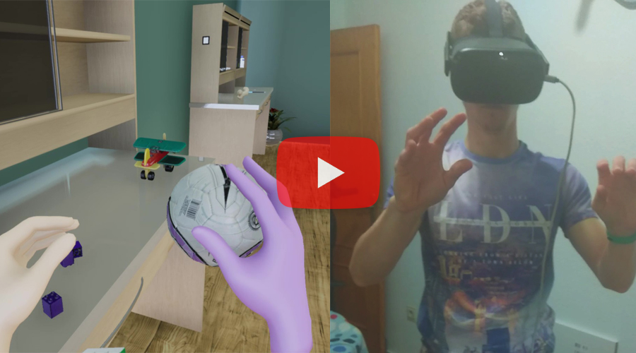
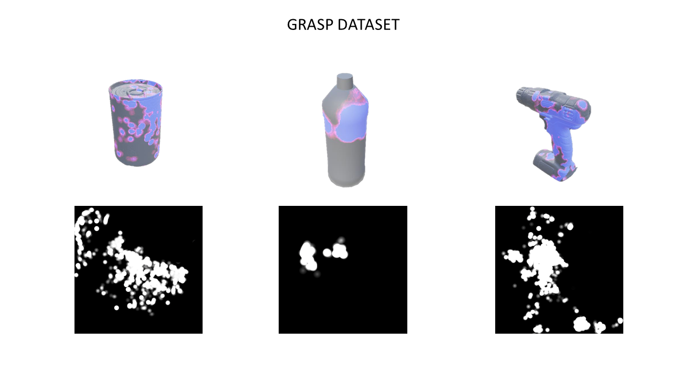

# UnrealHandGrasp

[](https://youtu.be/IXkU7_WnBMU)

## Description   

In this project we have developed an object grasping system in Unreal Engine 4. For the creation of this system, we have started from a base project named UnrealGrasp that has been modified to use the hand detection framework offered by Oculus and to be able to interact with the objects in the virtual environment only with our own hands.The work consisted in the implementation of an algorithm that decides when to move and lock the fingers of our virtual hand, as well as when we are grasping an object and when it has been released. Once this was done, it can be used to interact in an environment withmany objects. Different people have been asked to grasp different objects as they spawn in the environment. These objects appear sequentially and in different orientations to encourage differenttypes of grasping. This information has been collected in the format of a heat map, creat-ing a dataset of 12 objects that can be used in different fields, such as training an artificial intelligence system or making a more exhaustive study on grasping. Finally, an environment has been created in which the user can move and interact with objects of all kinds: toys, technical tools, laboratory utensils or foodstuffs, among others. This is intended to demonstrate the wide range of applications of this new technology.

### Dataset

A dataset of heat maps has been created, obtained from the collisions of the virtual hand with 12 objects. It has been automated so that every time you drop the object, the texture with the heat map is saved in the Content folder of the project with the name of the object in question.



## How to use  

First, install Unreal Engine 4, version 2.25 or upper.

```bash
# clone project   
git clone https://github.com/3dperceptionlab/unrealhandgrasp.git
```
The Environment map consists of a demo that uses this grasping system. In the Minimal default map you can grab objects and generate the dataset.

## Publication / Citation
If you use UnrealHandGrasp, please cite:
```
@inproceedings{Martinez2022_unrealhandgrasp,
	author    = {Pablo Martinez{-}Gonzalez and
	David Mulero{-}Perez and
	Sergiu Oprea and
	Manuel Benavent{-}Lledo and
	Sergio Orts{-}Escolano and
	Jose Garcia{-}Rodriguez},
	title     = {Synthetic contact maps to predict grasp regions on objects},
	booktitle = {International Joint Conference on Neural Networks (IJCNN)},
	pages     = {1--6},
   doi       = {10.1109/IJCNN55064.2022.9892548},
	year      = {2022}
}
```

## License / Credits

This code is released under the GPL-3.0 License.

Objects from the [Yale-CMU-Berkeley Object and Model Set](https://ieeexplore.ieee.org/document/7254318) library have been used.
Also, objects have been obtained from the [cgtrader](https://www.cgtrader.com) online library. Created by: alexsychov, lukass12, adren0chrome, cpenfold15, diegokrause, arthur-e.

## Contact / Authors

Any criticism and improvements are welcome using the issue system from this repository. For other questions, contact the corresponding authors:

- David Mulero-Perez ([dmulero@dtic.ua.es](mailto:dmulero@dtic.ua.es))
- Pablo Martinez-Gonzalez ([pmartinez@dtic.ua.es](mailto:pmartinez@dtic.ua.es))
- Sergiu Oprea ([soprea@dtic.ua.es](mailto:soprea@dtic.ua.es))
- Sergio Orts-Escolano ([sorts@ua.es](mailto:sorts@ua.es))
- Jose Garcia-Rodriguez ([jgarcia@dtic.ua.es](mailto:jgarcia@dtic.ua.es))

Part of this project has been carried out as an end-of-degree project by David Mulero-Perez:

```
@misc{2021unrealhandgrasp,
   title = {Interacción con objetos en Realidad Virtual utilizando tracking de manos},
   author = {Mulero Pérez, David},
   publisher = {Repositorio Institucional de la Universidad de Alicante (RUA)},
   url = {http://hdl.handle.net/10045/115937},
   year = {2021}
}
```
